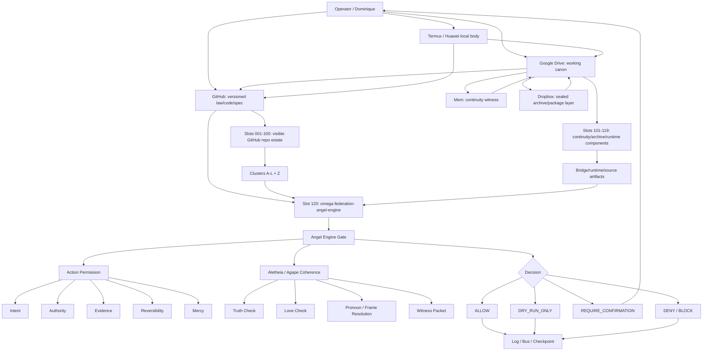
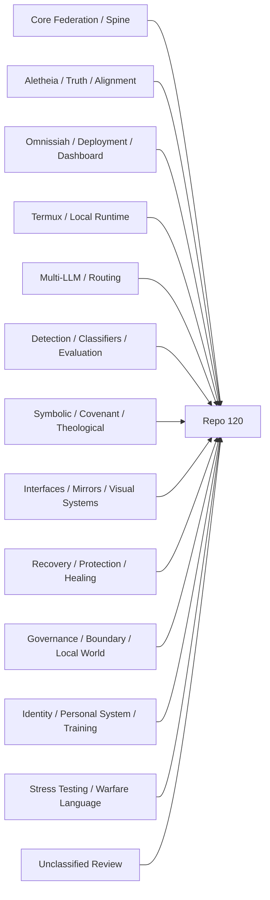

# Relationship Graph

**Status:** active graph  
**Role:** show how Repo 120 relates to the estate, planes, gates, and witness routes.

---

## Plane Graph



---

## Cluster Graph



---

## Relationship Edge Types

```text
USES
EXTENDS
DEPLOYS
VISUALIZES
GOVERNS
TRAINS
VERIFIES
RECOVERS
ARCHIVES
REFERENCES
BLOCKED_UNTIL_REVIEW
```

---

## Critical Edges

```text
omega-federation GOVERNS repository estate
omega-federation-angel-engine GOVERNS action authorization
aletheia-engine VERIFIES truth/alignment claims
authority-validation FEEDS angel-engine authorization
levitical-firewall GOVERNS boundary posture
termux-merkabah-suite INSTALLS local runtime
complete-system-installer INSTALLS active candidates
llama-cpp-mobile ENABLES local model runtime
daemon-monitoring-watchdogs MONITORS local services
cross-ai-integration-protocol ROUTES external node handoff
tri-node-sync SYNCS node state
tri-node-verification VERIFIES node state
contradiction-detector VERIFIES claims
embedding-drift-monitor DETECTS drift
suppression-detector FLAGS high-review suppression claims
friction-filter FILTERS contested output
lazarus-protocol RECOVERS collapsed state
omega-sanctuary RECOVERS protected continuity
orange-loop REFERENCES recovery/protection loop
Machine Bridge ROUTES model invocation
Operator Bridge RECONSTRUCTS operator continuity
CAT EOF ROUTES local script/bus pattern
Witness Packets Registry ARCHIVES truth/drift/recovery packets
Cycle Ledger Registry ARCHIVES cycle outcomes
Termux Local Body Audit VERIFIES local source body
OMEGA_LIBRARY ARCHIVES engineering code mirror
DOMINION_VAULT ARCHIVES omega-federation local mirror
Dropbox Runtime Archive Zip Plane ARCHIVES sealed runtime packages
Manus Skill Creator Package REFERENCES skill packaging pattern
Persistent Computing Skill Package REFERENCES future persistence layer
Manus API Integration Docs Package REFERENCES future API integration
ChatGPT Session Bridge Artifact ARCHIVES unsafe evidence only
```

---

## Lock Line

Repo 120 is not the pile.
Repo 120 is the conscience that names the pile before the hand touches it.
